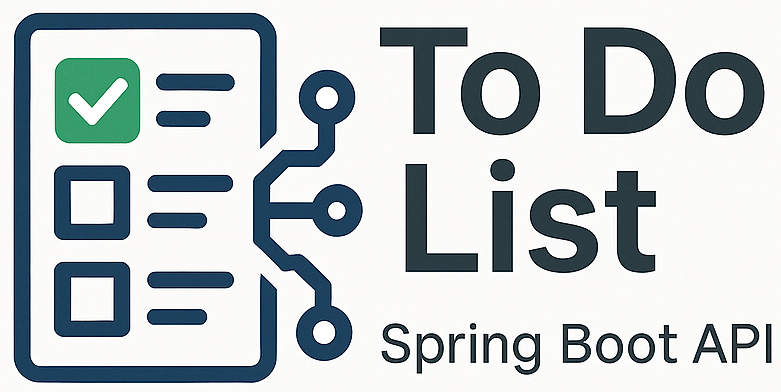
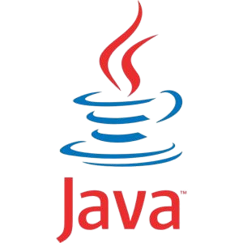
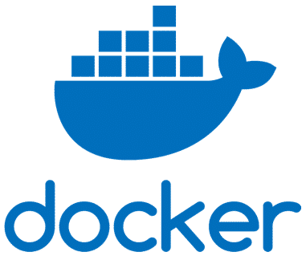

<p align="center">
  <a href="https://github.com/0nF1REy/to-do-list-springboot" target="_blank">
    
  </a>
</p>

<div align="center">


<br />

  
  
  
  
  

</div>

## 🧭 Guia de Navegação (Índice)

- **[📖 Descrição](#descricao)**
- **[🎯 Objetivos](#objetivos)**
- **[✨ Funcionalidades](#funcionalidades)**
- **[💻 Tecnologias](#tecnologias)**
- **[🔧 Pré-requisitos](#requisitos)**
- **[⚙️ Execução](#execucao)**
- **[✅ Acesso](#acesso)**
- **[📍 Endpoints](#endpoints)**
- **[📚 Tabela de Endpoints](#tabela)**
- **[📁 Estrutura](#estrutura)**
- **[🧪 Testes](#testes)**
- **[🧩 Configuração](#confambiente)**
- **[👤 Desenvolvedor](#desenvolvedor)**
- **[📫 Contribuir](#contribuicao)**
- **[📜 Licença](#licenca)**

<h1 align="center">
  To Do List - Spring Boot API
</h1>

## 📖 Descrição <a name="descricao"></a>

Este repositório contém uma **API REST** para uma Lista de Tarefas (To Do List), desenvolvida como um projeto de demonstração utilizando **Java** e o ecossistema **Spring Boot**. A aplicação permite que os usuários criem, listem, atualizem e deletem tarefas, persistindo os dados em um banco de dados **MariaDB**.

O projeto é totalmente containerizado com **Docker** e **Docker Compose**, facilitando a configuração e execução do ambiente completo (aplicação + banco de dados) com um único comando. Além disso, a documentação da API é gerada automaticamente com **SpringDoc OpenAPI (Swagger)**, proporcionando uma interface interativa para testar os endpoints.

## 🎯 Objetivos <a name="objetivos"></a>

- ✅ Fornecer um exemplo **prático, claro e bem estruturado** de como criar uma API REST com **Java 21** e **Spring Boot 3.x**, voltado tanto para iniciantes quanto para desenvolvedores mais experientes.
- ✅ Demonstrar **boas práticas de desenvolvimento backend**, como validação de dados, separação de camadas, testes automatizados e documentação com Swagger.
- ✅ Incentivar o uso de **Docker e Docker Compose** para facilitar o ambiente de desenvolvimento e promover a cultura DevOps desde a base.
- ✅ Servir como base para outros projetos ou estudos, ajudando a comunidade a entender conceitos essenciais como:
  - Injeção de dependências
  - Persistência com JPA
  - Versionamento com Git
  - Integração com bancos de dados como MariaDB e H2
- ✅ Estimular a **contribuição colaborativa** da comunidade open source por meio de issues, pull requests e sugestões de melhorias.
- ✅ Promover um aprendizado acessível e progressivo para quem deseja evoluir no desenvolvimento de APIs robustas e escaláveis com o ecossistema Spring.

## ✨ Funcionalidades e Práticas Adotadas <a name="funcionalidades"></a>

- **Operações CRUD completas** para gerenciamento de tarefas.
- API construída seguindo os princípios **REST**.
- Validação de dados de entrada com **Spring Boot Starter Validation**.
- Persistência de dados com **Spring Data JPA**.
- Geração automática da documentação da API com **SpringDoc OpenAPI**.
- Injeção de Dependências para baixo acoplamento.
- Containerização com **Docker** para um ambiente de desenvolvimento e produção consistente.
- Configuração de ambiente simplificada com **Docker Compose**.
- Testes de integração utilizando **WebTestClient**.

## 💻 Tecnologias Utilizadas <a name="tecnologias"></a>

| Tecnologia              | Descrição                                         |
|-------------------------|---------------------------------------------------|
| Java 21                 | *Linguagem de programação principal*              |
| Spring Boot 3.x         | *Framework para criação da aplicação*             |
| Spring Web              | *Módulo para construção de APIs REST*             |
| Spring Data JPA         | *Persistência de dados simplificada*              |
| MariaDB                 | *Banco de dados relacional utilizado*             |
| Maven                   | *Gerenciador de dependências e build do projeto*  |
| Docker & Docker Compose | *Containerização da aplicação e do banco de dados*|
| SpringDoc OpenAPI 2.x | *Documentação automática da API*                    |
| H2 Database	          | Banco de dados em memória para a execução de testes.|

## 🚀 Começando 

Para executar este projeto, você precisará ter os seguintes softwares instalados em sua máquina:

<div align="center">

## 🔧 Pré-requisitos <a name="requisitos"></a>

<a href="https://git-scm.com/" target="_blank">
  
</a>
<a href="https://www.oracle.com/java/" target="_blank">
  
</a>
<a href="https://maven.apache.org/" target="_blank">
  
</a>
<a href="https://www.docker.com/" target="_blank">
  
</a>

</div>

<br />

*   **Git:** Para controle de versão e clonar o repositório. [https://git-scm.com/](https://git-scm.com/)
*   **Maven:** Para construir e gerenciar dependências do projeto. [https://maven.apache.org/](https://maven.apache.org/)
*   **Java JDK:** Ambiente para executar a aplicação, versão 21 ou superior. [https://www.oracle.com/java/](https://www.oracle.com/java/)
*   **Docker:** Para containerizar a aplicação e o banco de dados. [https://www.docker.com/](https://www.docker.com/)

---

## ⚙️ Como Executar o Projeto <a name="execucao"></a>

Existem duas maneiras de executar a aplicação: utilizando Docker (método recomendado) ou localmente com Maven.

## Modo 1: Docker (Recomendado)

Este é o método mais simples, pois o Docker Compose cuidará de configurar a aplicação e o banco de dados.

1.  **Clone o repositório:**

    ```bash
    git clone https://github.com/0nF1REy/to-do-list-springboot
    cd to-do-list-springboot
    ```

2.  **Crie o arquivo de ambiente:**

- Na raiz do projeto, renomeie o arquivo ```.env.example``` para ```.env```. Você pode alterar as credenciais se desejar.

    ```bash
    cp .env.example .env
    ```

3.  **Suba os contêineres:**

- Este comando irá construir a imagem da aplicação e iniciar os serviços da aplicação e do banco de dados.

    ```bash
    docker compose up --build
    ```

## Modo 2: Localmente com Maven

1.  **Clone o repositório:**

    ```bash
    git clone https://github.com/0nF1REy/to-do-list-springboot
    cd to-do-list-springboot
    ```

2.  **Configure o Banco de Dados:**

- Certifique-se de ter uma instância do MariaDB (ou MySQL) rodando localmente. Em seguida, atualize o arquivo ```src/main/resources/application.properties``` com as suas credenciais. O arquivo deve ficar parecido com o exemplo abaixo:

    ```bash
    # --- Configuração do Banco de Dados Local (MariaDB/MySQL) ---
    spring.datasource.url=jdbc:mariadb://localhost:3306/to_do_list?createDatabaseIfNotExist=true

    # Substitua pelo seu usuário do banco de dados (ex: root).
    spring.datasource.username=seu_usuario_aqui

    # Substitua pela sua senha do banco de dados.
    spring.datasource.password=sua_senha_aqui
    ```

3.  **Execute a Aplicação (Escolha uma das opções abaixo):**

- **Opção A:** Execução Rápida (Modo de Desenvolvimento)

  Este comando inicia a aplicação diretamente. É o mais recomendado para desenvolver e testar rapidamente.

    ```bash
    ./mvnw spring-boot:run
    ```

  **OU**

- **Opção B:** Execução como Pacote (Simulando Produção)

  Este método primeiro compila e empacota sua aplicação em um arquivo ```.jar``` e depois o executa.

    ```bash
    # 1. Crie o pacote .jar
    ./mvnw clean package

    # 2. Execute o arquivo .jar gerado
    java -jar target/to-do-list-springboot-0.0.1-SNAPSHOT.jar
    ```

## ✅ Acesso à Aplicação <a name="acesso"></a>

-  A **API** estará disponível em: **```http://localhost:8080```**

-  O **Swagger** poderá ser visualizado em **```http://localhost:8080/swagger-ui.html```**

---

## 📍 Endpoints da API <a name="endpoints"></a>

Os exemplos abaixo utilizam a ferramenta **HTTPie** para facilitar testes em linha de comando.

- **📄 Criar Tarefa**

  ```
  http POST :8080/todos nome="Estudar Docker" descricao="Concluir curso sobre Docker Compose" prioridade=1
  ```

  Resposta:

  ```bash
  HTTP/1.1 200 OK
  [
    {
      "id": 1,
      "nome": "Estudar Docker",
      "descricao": "Concluir curso sobre Docker Compose",
      "prioridade": 1,
      "realizado": false
    }
  ]
  ```

- **📋 Listar Todas as Tarefas**

  ```
  http GET :8080/todos
  ```

  Resposta:

  ```bash
  HTTP/1.1 200 OK
  [
    {
      "id": 1,
      "nome": "Estudar Docker",
      "descricao": "Concluir curso sobre Docker Compose",
      "prioridade": 1,
      "realizado": false
    }
  ]
  ```

- **📝 Atualizar Tarefa**

  ```
  http PUT :8080/todos id=1 nome="Estudar Docker" descricao="Concluir curso sobre Docker Compose" prioridade=2 realizado=true
  ```

  Resposta:

  ```bash
  HTTP/1.1 200 OK
  [
    {
      "id": 1,
      "nome": "Estudar Docker",
      "descricao": "Concluir curso sobre Docker Compose",
      "prioridade": 2,
      "realizado": true
    }
  ]
  ```

- **🗑️ Remover Tarefa**

  ```
  http DELETE :8080/todos/1
  ```

  A resposta retorna a **lista atualizada de tarefas restantes** após a exclusão, conforme exemplo abaixo:

  ```bash
  HTTP/1.1 200 OK
  []
  ```

## 📚 Tabela de Endpoints <a name="tabela"></a>

| Ação                  | Método | Endpoint        | Descrição                             | Exemplo com `curl` |
|-----------------------|--------|------------------|-----------------------------------------|---------------------|
| 📄 Criar Tarefa        | POST   | `/todos`         | Cria uma nova tarefa                    | `curl -X POST http://localhost:8080/todos -H "Content-Type: application/json" -d '{"nome":"Estudar Docker","descricao":"Curso sobre Docker Compose","prioridade":1}'` |
| 📋 Listar Todas        | GET    | `/todos`         | Retorna a lista de todas as tarefas     | `curl http://localhost:8080/todos` |
| 📝 Atualizar Tarefa    | PUT    | `/todos`         | Atualiza uma tarefa existente           | `curl -X PUT http://localhost:8080/todos -H "Content-Type: application/json" -d '{"id":1,"nome":"Estudar Docker","descricao":"Curso completo","prioridade":2,"realizado":true}'` |
| 🗑️ Remover por ID      | DELETE | `/todos/{id}`    | Exclui uma tarefa pelo ID               | `curl -X DELETE http://localhost:8080/todos/1` |

*O endpoint de **remoção** retorna a lista atualizada de tarefas como confirmação.*

---

## 📁 Estrutura do Projeto <a name="estrutura"></a>

O projeto segue a estrutura padrão do Maven e adota uma arquitetura em camadas para organizar as responsabilidades:

  ```
  .
  ├── .mvn
  ├── database
  │   └── queries.sql        # Scripts SQL de exemplo
  ├── http
  │   └── requests.sh        # Exemplos de requisições com HTTPie
  ├── readme_images
  ├── src
  │   ├── main
  │   │   ├── java/br/com/alanryan/to_do_list_springboot
  │   │   │   ├── controller # (Camada de Apresentação) Recebe requisições HTTP
  │   │   │   ├── entity     # (Camada de Domínio) Representa as tabelas do banco
  │   │   │   ├── repository # (Camada de Persistência) Interface com o banco de dados
  │   │   │   ├── service    # (Camada de Serviço) Contém a lógica de negócio
  │   │   │   └── ToDoListSpringbootApplication.java
  │   │   └── resources
  │   │       ├── application.properties # Configurações da aplicação
  │   │       └── ...
  │   └── test
  │       └── java/br/com/alanryan/to_do_list_springboot
  │           └── ToDoListSpringbootApplicationTests.java # Testes de integração
  ├── .env.example           # Exemplo de variáveis de ambiente
  ├── compose.yml            # Arquivo do Docker Compose
  ├── Dockerfile             # Define a imagem Docker da aplicação
  ├── pom.xml                # Arquivo de configuração do Maven
  └── ...
  ```

## 🧪 Testes Automatizados <a name="testes"></a>

O projeto inclui testes de integração que validam o comportamento dos endpoints da API. Eles utilizam um banco de dados **H2 em memória** para garantir que os testes sejam rápidos e isolados do ambiente de desenvolvimento.

### ▶️ Como executar os testes

Para executar os testes, rode o seguinte comando na raiz do projeto:

  ```bash
  ./mvnw test
  ```

---

## 🧩 Configuração do Ambiente <a name="confambiente"></a>

- **```application.properties``` para produção:**

  ```bash
  spring.application.name=to-do-list-springboot
  spring.jpa.properties.hibernate.dialect=org.hibernate.dialect.MariaDBDialect
  spring.datasource.url=jdbc:mariadb://localhost:3306/to_do_list
  spring.datasource.username=user
  spring.datasource.password=secret
  spring.jpa.hibernate.ddl-auto=update
  spring.jpa.show-sql=true
  ```

- **```.env``` para Docker:**

  ```bash
  MYSQL_DATABASE=to_do_list
  MYSQL_USER=user
  MYSQL_PASSWORD=secret
  MYSQL_ROOT_PASSWORD=verysecret
  ```

<div align="center">

## 👤 Sobre o Desenvolvedor <a name="desenvolvedor"></a>
                       
<table>
  <tr>
    <td align="center">
      <a href="https://github.com/0nF1REy" target="_blank">
        <br>
        <b>Alan Ryan</b>
      </a>
      <p>
        ☕ Peopleware | Tech Enthusiast | Code Slinger ☕<br>
        Apaixonado por código limpo, arquitetura escalável e experiências digitais envolventes.
      </p>
      <p style="font-weight: bold; color: #0077B5;">
        Conecte-se comigo:
      </p>
      <p>
        <a href="https://github.com/0nF1REy" target="_blank">
          
        </a>
        <a href="https://gitlab.com/alanryan619" target="_blank">
          
        </a>
        <a href="https://www.linkedin.com/in/alan-ryan-b115ba228" target="_blank">
          
        </a>
        <a href="mailto:alanryan619@gmail.com" target="_blank">
          
        </a>
      </p>
    </td>
  </tr>
</table>

</div>

---

## 📫 Contribuir <a name="contribuicao"></a>

Contribuições são muito bem-vindas! Se você deseja contribuir com o projeto, por favor, siga estes passos:

1.  **Faça um Fork** do repositório.

2.  **Crie uma nova Branch** para sua feature ou correção: 

    ```bash
    git checkout -b feature/nome-da-feature
    ```

3.  **Faça suas alterações** e realize o commit:

    ```bash
    git commit -m "feat: Adiciona nova feature"
    ```

4.  **Envie suas alterações** para o seu fork:

    ```bash
    git push origin feature/nome-da-feature
    ```

5.  **Abra um pull request** para a branch `main` do repositório original.

### Recursos Úteis

- **<a href="https://www.atlassian.com/br/git/tutorials/making-a-pull-request" target="_blank">📝 Como criar um Pull Request</a>**

- **<a href="https://www.conventionalcommits.org/en/v1.0.0/" target="_blank">💾 Padrão de Commits Convencionais</a>**

## 📜 Licença <a name="licenca"></a>

Este projeto está sob a **licença MIT**. Consulte o arquivo **[LICENSE](LICENSE)** para obter mais detalhes.

> ℹ️ **Aviso de Licença:** © 2025 Alan Ryan da Silva Domingues. Este projeto está licenciado sob os termos da licença MIT. Isso significa que você pode usá-lo, copiá-lo, modificá-lo e distribuí-lo com liberdade, desde que mantenha os avisos de copyright.
